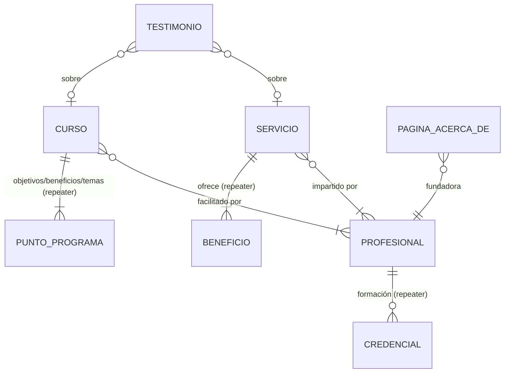

# Content Model

> Status: **proposal — nothing here is implemented yet.**
> Source analysed: Figma file *Álmica-Healing*, page **Website - MV1** (`node-id=146-30`), inspected 2026-09-18.
> Also consulted for context only: pages *Mapa de sitio* and *Website - MV2*. **Phase 1 = MV1 only**; everything else is deferred (see [Decisions](#decisions-2026-09-19)).
> Field plugin: **Secure Custom Fields (SCF)**, free. ACF Pro is out of budget.
> Machine-readable companion: [`content-model.yaml`](content-model.yaml).

## Executive Summary

The MV1 page contains **20 frames**, but they are only **7 distinct layouts**. 16 of the 20 frames are
instances of 3 repeatable templates:

| Template | Frames | What varies between frames |
|---|---|---|
| Service detail | 11 | copy, price, images, number of benefits, therapist |
| Course detail | 3 | copy, price/duration, level, list heading |
| Legal document | 2 | copy, active tab |

The other 4 frames are unique pages: Home, Acerca de, the Servicios listing, and the Cursos listing.
In Figma the Cursos listing frame is misnamed "Set Typography Styles".

The design has four domain entities:

- **Servicio**: a bookable individual session (11 instances).
- **Curso**: a multi-week program (3 instances).
- **Profesional**: the person who delivers a service or course. Five names appear, one of them twice
  (as a therapist and as the founder).
- **Testimonio**: a client quote.

The theme already has `servicio`, `curso` and `testimonio` post types. The main gap is that
**Profesional doesn't exist as an entity yet**. In Figma the same therapist card (photo, name, role,
two-paragraph bio) is copied by hand onto up to five service frames. That copying has already produced
wrong data in the design: frames with the wrong name, the wrong photo or another therapist's bio. This
is the strongest argument for making Profesional a relationship target rather than repeating it inside
each service.

Phase 1 is MV1 only. The shop (**Producto**, candles and workbooks), the Contáctanos page and
booking appear only in the sitemap or MV2 and are **deferred**; they are listed under
[Deferred](#deferred-out-of-phase-1) and are not part of this model.

No taxonomy is needed in phase 1.

## Figma Pattern Analysis

### Page patterns

| Pattern | Kind | Frames | Notes |
|---|---|---|---|
| **Home** | Unique page | 1 | Hero, intro, services teaser (6 featured), "Tu proceso comienza aquí" (3 steps), quote interlude, courses teaser, testimonial slider, footer |
| **Acerca de** | Unique page | 1 | Hero, "Nosotros" history text, founder profile (Alma Solís), "Formación" credentials list |
| **Servicios** | Listing | 1 | Hero plus a grid of all 11 service cards (image, title, "Ver más") |
| **Cursos** ("Set Typography Styles") | Listing | 1 | Hero ("Formación / Programas para crecer desde adentro.") plus 3 course cards (image, level badge, title, summary, price and duration **or** "Escríbenos para conocer el precio", "Ver más") |
| **Servicio detail** | Instance template | 11 | See below |
| **Curso detail** | Instance template | 3 | See below |
| **Legal** | Instance template | 2 | Shared hero "Información legal y de privacidad." with two tabs (Aviso de Privacidad / Términos y Condiciones), intro line, numbered sections (title and body), contact note box |

### Servicio detail anatomy (identical across all 11 frames)

1. Header navigation (global)
2. Hero: "← Volver a servicios", eyebrow "SERVICIOS", **title**, **tagline**, **duration chip** ("60 min")
3. "SOBRE ESTE SERVICIO": **description** (2 paragraphs)
4. "INVERSIÓN" card: **price** ("$850.00 MXN"), "por sesión individual", Duración (**same value as the hero chip**), **Modalidad** ("Presencial")
5. "BENEFICIOS / Lo que esta sesión puede ofrecerte": **1–5 benefit tiles** (icon, title, optional description)
6. "QUIÉN IMPARTE": **therapist** (round photo, name, role line, 2-paragraph bio)
7. "OTROS SERVICIOS": 3 related service cards
8. Footer (global)

### Curso detail anatomy (identical across all 3 frames)

1. Header navigation ("Cursos" active)
2. Hero: **program label pill** ("CURSO INTERMEDIO DE CANALIZACIÓN Y SANACIÓN"), **title**, **tagline**
3. "SOBRE EL CURSO": **description** (2 paragraphs)
4. Numbered list box. **The heading varies**: "OBJETIVOS" (Clantanra), "BENEFICIOS" (Riutunmi), "TEMAS" (Lo Que Nadie Nos Enseñó)
5. Sidebar: "INVERSIÓN" card (**price** and **duration**, e.g. "$5,900 MXN / 2 meses"), omitted when the price is on request (Clantanra); "FACILITADOR/A" card (**professional** photo and name); "¿TE INTERESA ESTE PROGRAMA?" card (**global** copy and the contact email)
6. "OTROS PROGRAMAS": the other courses (image, level, title)
7. Footer (global)

### Site-wide components (not content types)

- **Header**: logo plus the primary menu (Inicio, Acerca de, Servicios, Cursos; Tienda is deferred).
- **Footer**: logo and blurb; NAVEGACIÓN (Acerca de, Servicios, Cursos, Tienda, Contáctanos); LEGAL (Términos y condiciones, Aviso de privacidad); CONTACTO (email, phone, "México · sesiones virtuales", IG/FB/TK); copyright; tagline "El equilibrio que da origen a todo".
- **Service card**: used by the Home teaser, the Servicios grid and "Otros servicios".
- **Course card**: used by the Home teaser, the Cursos grid and "Otros programas".

### Semantic duplication found in the UI (stored once in the model)

| UI appears in… | Single field |
|---|---|
| Service hero chip "60 min" **and** Inversión › Duración | `servicio.duration_minutes` |
| Service card title, hero title, "Otros servicios" card, contact-form "Servicio de interés" option | `post_title` |
| Service card image and "Otros servicios" image | featured image |
| Therapist block repeated on every service they deliver | one `profesional` post |
| Founder on Acerca de **and** "Facilitador/a" on every course | one `profesional` post (Alma Solís) |
| Course level badge on listing cards, "Otros programas" cards, Home teaser | `curso.level` |
| Contact email on course pages, legal pages and footer | global `contact_email` |
| Footer contact block on every frame | global settings |

## Domain Model

| Entity | Independent lifecycle | Reused | Own URL | Decision |
|---|---|---|---|---|
| Servicio | yes | cards in 3 places, contact form | yes | CPT (exists) |
| Curso | yes | cards in 3 places | yes | CPT (exists) |
| Profesional | yes (joins and leaves the practice) | yes: 1 → up to 5 services, 3 courses, Acerca de | not in MV1 | CPT, **not publicly queryable** |
| Testimonio | yes | Home slider | no | CPT (exists), not public |
| Beneficio | no, only meaningful inside one service | no (the texts differ per service) | no | repeater on Servicio |
| Punto de programa | no | no | no | repeater on Curso |
| Credencial | no | no | no | repeater on Profesional |
| Nivel de curso | n/a | 3 fixed values, no listing per level | no | select field, **not** a taxonomy |
| Modalidad | n/a | fixed values, no filtering | no | select field (enum) |

Why these are fields rather than taxonomies: level and modality have a few fixed values, no archive
page, and nothing in the design filters by them. A taxonomy would add admin screens and term
management without any benefit. If the Cursos page ever gets filters, promote `level` to a taxonomy.

## Content Types

Conventions:

- Post-type keys stay **Spanish**, as already registered (`servicio`, `curso`, `testimonio`). Renaming
  them would orphan existing content and permalinks.
- Field names are **English snake_case semantic names**.
- Source `SCF` = a custom field registered with Secure Custom Fields (see [Field groups](#field-groups-secure-custom-fields)).
- "Rec. limit" means a layout-driven recommendation, not a business rule. Enforce it softly (character
  counter or warning), not as a hard block, unless marked otherwise.

### Servicio

Purpose: an individual session that can be booked. Shown as a card in listings and has its own detail
page. WordPress object: **CPT `servicio`** (exists). Editor-managed: yes. Reusable: yes.

| Field | Source | Type | Req. | Card. | Default | Validation / notes |
|---|---|---|---|---|---|---|
| title | `post_title` | text | ✔ | 1 | — | Rec. ≤ 60 chars. Some titles wrap to 2 lines in the hero, and the design allows that |
| slug | `post_name` | slug | ✔ | 1 | from title | Stable import ID. URL `/servicios/{slug}/` |
| summary | `post_excerpt` | textarea | ✔ | 1 | — | Rec. ≤ 160 chars. Hero subtitle unless `tagline` is set; also used as the meta description |
| tagline | SCF | text | – | 0..1 | falls back to `summary` | Hero subtitle override |
| description | `post_content` | rich text | ✔ | 1 | — | "Sobre este servicio", 1–3 paragraphs, no headings |
| card_image | featured image | image | ✔ | 1 | — | Service card and "Otros servicios". Min 800×1000, portrait crop |
| hero_image | SCF | image | – | 0..1 | falls back to featured image | Figma uses a different photo in the hero than on the card for several services |
| price | SCF | number | ✔ | 1 | — | ≥ 0, 2 decimals, MXN. Shown as "$1,150.00 MXN" |
| price_basis | SCF | text | – | 0..1 | global `service_price_basis` ("por sesión individual") | Override only when a service isn't priced per session |
| duration_minutes | SCF | number | ✔ | 1 | 60 | Integer 15–480. Rendered in **both** the hero chip and the Inversión card |
| modality | SCF | select (enum) | ✔ | 1 | `presencial` | `presencial` "Presencial", `virtual` "Virtual", `hibrida` "Presencial y virtual". All 11 frames show Presencial |
| benefits | SCF | repeater | ✔ | 1..6 | — | See Beneficio. Observed 1–5 per service |
| professionals | SCF | relationship → `profesional` | – | 0..3 | empty | "Quién imparte". Observed 1 per service. Leave empty when the therapist isn't confirmed; the section is then hidden. More than one renders stacked cards |
| related_services | SCF | relationship → `servicio` | – | 0..3 | automatic (see Q5) | "Otros servicios". Leave empty to fill automatically |
| is_featured | SCF | true/false | – | 1 | false | Shown in the Home teaser (6 slots). Replaces the existing `_almicahealing_featured` meta |
| includes_workbook | SCF | true/false | – | 1 | false | From the Figma sticky note. ⚠ Q6 |
| order | `menu_order` | number | – | 1 | 0 | Order in every listing |

**Beneficio** (repeater row, embedded)

| Field | Type | Req. | Validation |
|---|---|---|---|
| icon | select (from a fixed theme icon set) | ✔ | One of the icon slugs (see Q8). Editors never upload icons |
| title | text | ✔ | Rec. ≤ 70 chars |
| description | textarea | – | Rec. ≤ 140 chars. Empty in several frames (Futuros Posibles, Limpieza y Conexión con Personas / Emocional) and the tile must still work without it |

### Curso

Purpose: a multi-week training program led by a facilitator. WordPress object: **CPT `curso`** (exists).
Editor-managed: yes. Reusable: yes.

| Field | Source | Type | Req. | Card. | Default | Validation / notes |
|---|---|---|---|---|---|---|
| title | `post_title` | text | ✔ | 1 | — | |
| slug | `post_name` | slug | ✔ | 1 | — | URL `/cursos/{slug}/` |
| summary | `post_excerpt` | textarea | ✔ | 1 | — | Listing card and Home teaser text. Rec. ≤ 160 chars. **Differs** from the hero tagline in Figma |
| tagline | SCF | text | – | 0..1 | falls back to `summary` | Hero subtitle |
| description | `post_content` | rich text | ✔ | 1 | — | "Sobre el curso" |
| image | featured image | image | ✔ | 1 | — | Card, hero and "Otros programas" all use the same photo in Figma |
| program_label | SCF | text | ✔ | 1 | — | Hero pill, e.g. "Curso intermedio de canalización y sanación". Rec. ≤ 50 chars |
| level | SCF | select | ✔ | 1 | — | `basico` "Básico", `intermedio` "Intermedio", `abierto` "Abierto a todos". ⚠ Q9 |
| price | SCF | number | – | 0..1 | empty = "price on request" | ≥ 0, whole MXN. Shown as "$5,900 MXN". When empty, show the global `price_on_request_text` and hide the Inversión card |
| duration | SCF | text | ✔ if price set | 0..1 | — | Free text: "2 meses", "3 meses". Rec. ≤ 30 chars |
| outcomes_heading | SCF | select | ✔ | 1 | `objetivos` | `objetivos`, `beneficios`, `temas` |
| outcomes | SCF | repeater | ✔ | 1..10 | — | One `text` subfield (≤ 160 chars). Rendered as a numbered list. Numbers are generated automatically, never typed (Figma has a duplicated "4") |
| facilitators | SCF | relationship → `profesional` | ✔ | 1..2 | — | "Facilitador/a" card |
| order | `menu_order` | number | – | 1 | 0 | |

"Otros programas" isn't a field: it shows all other published courses (there are only 3).

### Profesional (new)

Purpose: a therapist, facilitator or founder, written once and referenced everywhere they appear.
WordPress object: **CPT `profesional`** with `public => false`, `show_ui => true` (MV1 has no profile
pages; see Q7). Editor-managed: yes. Reusable: yes (this is the main reason it exists).

| Field | Source | Type | Req. | Card. | Default | Validation / notes |
|---|---|---|---|---|---|---|
| name | `post_title` | text | ✔ | 1 | — | Full display name |
| slug | `post_name` | slug | ✔ | 1 | — | Stable import ID (e.g. `gabriela-dominguez`) |
| role | SCF | text | ✔ | 1 | — | Gold line under the name, e.g. "Terapeuta Holística. Especialista en Terapia Centrada en Soluciones". Rec. ≤ 100 chars |
| bio | `post_content` | rich text | ✔ | 1 | — | 1–3 paragraphs |
| photo | featured image | image | ✔ | 1 | — | Square, min 400×400, shown as a circle |
| credentials | SCF | repeater | – | 0..n | — | "Formación" on Acerca de. See Credencial |
| order | `menu_order` | number | – | 1 | 0 | |

**Credencial** (repeater row): `title` (text, ✔), `year` (number, 4 digits, –), `institution`
(text, –), `description` (textarea, –).

Instances to seed (4): Alma Solís (founder, all 3 courses), Elizabeth de las Casas (Arteterapia),
Gabriela Domínguez (3 services), Tonathiu Muñoz (5 services). "Perla Berrones" appears on one frame
with placeholder data and is **not** seeded (decision D4).

### Testimonio

Purpose: a client quote on Home. WordPress object: **CPT `testimonio`** (exists; not public).

| Field | Source | Type | Req. | Card. | Notes |
|---|---|---|---|---|---|
| client_name | `post_title` | text | ✔ | 1 | Display form, e.g. "Valentina R.". Editorial rule: first name plus initial |
| quote | `post_content` | textarea | ✔ | 1 | Rec. ≤ 300 chars |
| about | SCF | post object → `servicio` \| `curso` | – | 0..1 | Label under the name comes from the related post's title. **Replaces** today's free-text excerpt ("Biodescodificación"), which drifts when a service is renamed |
| order | `menu_order` | number | – | 1 | |

### Pages (WordPress Page, not CPT)

| Page | Slug | Template | Page-level fields |
|---|---|---|---|
| Home | front page | `front-page.php` | `hero` (eyebrow, title, subtitle, image, CTA label and link), `intro` (title, body, image, CTA), `services_intro` (eyebrow, title, subtitle), `process_steps` repeater (title, body; 3 rows), `quote` (line 1, line 2, image), `courses_intro` (eyebrow, title, body), `testimonials_title` |
| Acerca de | `acerca-de` | `page-acerca-de.php` | `hero` (eyebrow, title, subtitle, image), "Nosotros" text = `post_content`, `founder` → `profesional` (Formación comes from the founder's `credentials`) |
| Servicios | `servicios` | `page-servicios.php` | `hero` (eyebrow, title, subtitle). The grid is a query, not a field |
| Cursos | `cursos` | `page-cursos.php` (new) | `hero` (eyebrow, title, subtitle). The grid is a query |
| Aviso de privacidad | `aviso-de-privacidad` | `page-templates/legal.php` | none. Intro and sections are `post_content` (H2 per section, numbered by CSS) |
| Términos y condiciones | `terminos-y-condiciones` | `page-templates/legal.php` | none |

The page `hero` is the same field group (eyebrow, title, subtitle, image) reused on every page, not
separate per-page fields. Legal sections are plain prose in `post_content`: a repeater would add no
value for long legal text and would make it harder to paste in text from a lawyer.

## WordPress Mapping

### Objects

| Entity | WP object | Key | Supports | Public / archive | Rewrite |
|---|---|---|---|---|---|
| Servicio | CPT | `servicio` (exists) | title, editor, excerpt, thumbnail, page-attributes | public, `has_archive=false` (Page is the listing) | `servicios` |
| Curso | CPT | `curso` (exists) | title, editor, excerpt, thumbnail, page-attributes | public, `has_archive=false` | `cursos` |
| Profesional | CPT | `profesional` (**new**) | title, editor, thumbnail, page-attributes | `public=false`, `show_ui=true` | none |
| Testimonio | CPT | `testimonio` (exists) | title, editor, page-attributes (drop `excerpt` after migration) | not public | none |
| Global settings | SCF options page | `almica-ajustes` | — | — | — |
| Nav menus | native menus | `primary`, `footer` (exist) | — | — | — |

Having both a `servicios` Page and `servicio` singles under `/servicios/{slug}/` already works today,
and the same pattern applies to `cursos`.

### Native fields reused (not duplicated)

| Native field | Servicio | Curso | Profesional | Testimonio |
|---|---|---|---|---|
| `post_title` | title | title | name | client name |
| `post_name` | slug / import ID | slug / import ID | slug / import ID | slug / import ID |
| `post_excerpt` | summary (hero fallback, SEO) | summary (cards) | — | — |
| `post_content` | description | description | bio | quote |
| featured image | card image | image | photo | — |
| `menu_order` | listing order | listing order | order | slider order |

### Field groups (Secure Custom Fields)

**Plugin choice (decision D2).** ACF Pro is out of budget. Use
[Secure Custom Fields](https://wordpress.org/plugins/secure-custom-fields/) (SCF), the free fork of ACF
maintained on WordPress.org. It includes the ACF Pro field types this model needs: repeater,
relationship, and options pages. As of this writing it's at v6.9.5, tested up to WordPress 7.1.1, and
requires PHP 7.4+ (the site runs WP 7.1 / PHP 8.2).

Because SCF is an ACF fork, it keeps ACF's PHP API (`acf_add_local_field_group()`, `get_field()`,
`acf_add_options_page()`). Confirm those three calls work when the plugin is installed (Ticket 1).
The field types below use ACF/SCF type names.

- Register every group **in code** inside `almicahealing-core` (`acf_add_local_field_group()`), so the
  schema is versioned and deploys with the plugin; don't define fields through the admin UI.
- Wrap all reads in theme helpers (`almicahealing_field( $key, $post )`) instead of calling
  `get_field()` directly in templates. This keeps the theme working if SCF is inactive, and makes a
  later switch to hand-coded meta a contained change.
- SCF is installed as a normal plugin. The `.gitignore` allowlist keeps it out of this repo, the
  same as `query-monitor`. Install it on production before deploying code that depends on it.

**Fallback if SCF is ruled out: code it ourselves.** Only a few fields in this model are hard without a
plugin:

| Feature | Hand-coded approach | Effort |
|---|---|---|
| Scalars (text, number, select, boolean) | `register_post_meta()` + a meta box or a block-editor sidebar panel | low |
| Relationships | Meta storing post IDs + a searchable multi-select | medium |
| Repeaters (benefits, outcomes, credentials, process steps) | Serialized JSON meta + a small React list control | high; this is the main cost |
| Options page | Settings API page | low |

Estimate the hand-coded route at a few extra days, mostly spent on the repeater UI. Take it only if a
free plugin is unacceptable for policy reasons.

| Group | Location | Fields (SCF type) |
|---|---|---|
| `group_servicio` "Servicio" | post_type == servicio | `tagline` (text), `hero_image` (image, return ID), `price` (number, step 0.01, min 0), `price_basis` (text, placeholder = global), `duration_minutes` (number, min 15, max 480, step 15, default 60), `modality` (select: presencial, virtual, hibrida), `benefits` (repeater: `icon` select, `title` text, `description` textarea; min 1, max 6, layout block), `professionals` (relationship → profesional, min 0, max 3, return ID), `related_services` (relationship → servicio, max 3), `is_featured` (true_false, ui), `includes_workbook` (true_false) |
| `group_curso` "Curso" | post_type == curso | `tagline` (text), `program_label` (text), `level` (select), `price` (number, min 0), `duration` (text), `outcomes_heading` (select), `outcomes` (repeater: `text` text; min 1, max 10), `facilitators` (relationship → profesional, min 1, max 2) |
| `group_profesional` "Profesional" | post_type == profesional | `role` (text), `credentials` (repeater: `title` text, `year` number, `institution` text, `description` textarea) |
| `group_testimonio` "Testimonio" | post_type == testimonio | `about` (post_object → servicio, curso; allow null) |
| `group_page_hero` "Encabezado de página" | page template ∈ {front-page, acerca-de, servicios, cursos} | `hero_eyebrow` (text), `hero_title` (text), `hero_subtitle` (textarea), `hero_image` (image), `hero_cta_label` (text), `hero_cta_url` (link) |
| `group_home` "Inicio" | page == front page | `intro` (group), `services_intro` (group), `process_steps` (repeater, exactly 3), `quote` (group), `courses_intro` (group), `testimonials_title` (text) |
| `group_acerca_de` "Acerca de" | page template == acerca-de | `founder` (post_object → profesional, required) |
| `group_ajustes` "Ajustes de Álmica" | options page | see [Global Content](#global-content) |

**Relationship direction:** store the relationship on the side editors think from (service → its
professionals, course → its facilitators). The reverse direction ("which services does Gabriela
deliver?") is only needed in admin. It can be derived with a meta query and doesn't need to be stored
twice, so bidirectional sync isn't required.

**Migration from the current implementation:**

- `_almicahealing_featured` → `is_featured`
- `testimonio.post_excerpt` → `about`
- `curso.post_excerpt` currently holds the hero tagline, not the card summary. Move it to `tagline` and
  fill in the real summary.
- The hard-coded founder bio and "Formación" array in the theme become data on the `profesional` post
  for Alma Solís.
- `inc/brand.php` becomes the options page.

## Template Mapping

| Template | Status | Renders |
|---|---|---|
| `front-page.php` | exists (hard-coded copy) | Home. Switch copy to `group_page_hero` + `group_home` |
| `page-acerca-de.php` | exists (hard-coded) | Acerca de. Founder and Formación come from the related `profesional` |
| `page-servicios.php` | exists | Servicios listing (all `servicio` by `menu_order`) |
| `page-cursos.php` | **new** | Cursos listing (all `curso`) |
| `single-servicio.php` | **new** (today `single.php` is a generic fallback) | Service detail |
| `single-curso.php` | **new** | Course detail |
| `page-templates/legal.php` | exists (no hero or tabs yet) | Both legal pages. Shared hero and tab bar linking the two pages |
| `single-profesional.php` | not needed | profesional isn't public |
| `archive-servicio.php` / `archive-curso.php` | not needed | Pages provide the listings (editable hero). Revisit only if listings need pagination or filters |

Shared template parts:

- `card-servicio` (Home teaser, Servicios grid, Otros servicios)
- `card-curso` (Home teaser, Cursos grid; compact variant for Otros programas)
- `profesional-block` (Quién imparte, founder on Acerca de)
- `facilitator-chip` (course sidebar)
- `benefit-grid`
- `numbered-list`
- `page-hero`
- `legal-tabs`

## Figma → Content Model Mapping

Figma layer names are unreliable: several frames reuse another frame's name. The table uses the
**on-canvas title**, with the layer name shown in parentheses where it differs. The canvas order is
the order of Dev Mode's frame pager (1–20). Node IDs are listed where they were confirmed during
inspection.

| # | Figma frame (layer name) | Node | Model | Template | Kind | Separate dev ticket? |
|---|---|---|---|---|---|---|
| 1 | Home | 146-31 | Page (front) plus featured `servicio` ×6, `curso` ×3, `testimonio` | `front-page.php` | unique | yes (exists; field-ify) |
| 2 | Acerca de | 146-432 | Page plus `profesional` (Alma Solís) | `page-acerca-de.php` | unique | yes (exists; field-ify) |
| 3 | Servicios | 146-634 | Page plus `servicio` query | `page-servicios.php` | listing | yes (exists) |
| 4 | Cursos (**"Set Typography Styles"**) | — | Page plus `curso` query | `page-cursos.php` | listing | **yes (new)** |
| 5 | Curso Clantanra | 177-748 | `curso` instance: level Intermedio, price on request, list "Objetivos" | `single-curso.php` | **reference instance** | yes (builds the template) |
| 6 | Curso Riutunmi | — | `curso` instance: Básico, $5,900 / 2 meses, list "Beneficios" | `single-curso.php` | instance | no → content/QA |
| 7 | Curso Lo Que Nadie Nos Enseñó | 181-5149 | `curso` instance: Abierto a todos, $4,700 / 3 meses, list "Temas" | `single-curso.php` | instance | no → content/QA |
| 8 | Aviso de privacidad | — | Page (legal) | `legal.php` | **reference instance** | yes (hero and tabs) |
| 9 | Términos y condiciones | — | Page (legal) | `legal.php` | instance | no → content/QA |
| 10 | Arteterapia (Servicio - arteterapia) | 146-893 | `servicio`: $850, 60 min, 5 benefits, Elizabeth de las Casas | `single-servicio.php` | **reference instance** | yes (builds the template) |
| 11 | Biodecodificación (Servicio - biodecodificación) | 181-5706 | `servicio`: $1,200, 3 benefits, Gabriela Domínguez | `single-servicio.php` | instance | no → content/QA |
| 12 | Constelación Familiar para el Trabajo (Servicio - biodecodificación) | 218-2 | `servicio`: $1,100, 3 benefits, Gabriela Domínguez | `single-servicio.php` | instance | no |
| 13 | Armonización Energética Laboral y Bloqueos Relacionados (Servicio - biodecodificación) | — | `servicio`: $1,150, 3 benefits, Gabriela Domínguez | `single-servicio.php` | instance | no |
| 14 | Limpieza Energética de Lugares (Servicio - limpieza energética) | 245-2 | `servicio`: $1,800, 3 benefits, Tonathiu Muñoz | `single-servicio.php` | instance | no |
| 15 | Escaneo y Balance Energético en Personas (Servicio - limpieza energética) | — | `servicio`: $1,150, 2 benefits, Tonathiu Muñoz | `single-servicio.php` | instance | no |
| 16 | Conexión con Seres Trascendidos (Servicio - limpieza energética) | 245-473 | `servicio`: $1,300, 2 benefits, Tonathiu Muñoz | `single-servicio.php` | instance | no |
| 17 | Conexión con Registros | — | `servicio`: $1,300, 2 benefits, Tonathiu Muñoz | `single-servicio.php` | instance | no |
| 18 | Futuros Posibles (Servicio - limpieza energética) | — | `servicio`: $1,300, 2 benefits (title only), Tonathiu Muñoz | `single-servicio.php` | instance | no |
| 19 | Limpieza y Conexión con Personas (Servicio - limpieza energética) | 268-5817 † | `servicio`: $1,150, 2 benefits (title only), professionals **blank** (D4) | `single-servicio.php` | instance | no |
| 20 | Limpieza y Conexión Emocional con Personas (Servicio - limpieza energética) | 268-6039 | `servicio`: $1,150, 3 benefits (title only), professionals **blank** (D4) | `single-servicio.php` | instance | no |
| — | Sticky: "incluir que se descarga cuadernillo cuando contratan el servicio" | — | `servicio.includes_workbook` (Q6) | — | annotation | no → open question |
| — | Text ×3: "reemplazar foto terapeuta" | — | `profesional.photo` (content task) | — | annotation | no → content task |

† Node ID inferred from pager position (19 of 20), not read directly from the selected frame.

All 11 service frames share one hero duration value (60 min) and one modality ("Presencial").

**Totals:** 20 frames, 4 annotations.

- **16 frames are content instances** of 3 templates (11 servicio, 3 curso, 2 legal).
- **13** of those need no development ticket beyond the reference instance of their template.
- 4 frames are unique implementations.

### Variations inside the instance templates (template must handle; not separate tickets)

| Variation | Where | Handling |
|---|---|---|
| 1–5 benefit tiles (3-column grid; rows of 3 then 2, or a single tile) | services | Grid with auto-flow. No per-count layouts |
| Benefit without description | frames 18–20 | Description optional |
| Hero title wrapping to 2 lines | frames 13, 15, 20 | Normal text flow |
| Course without price → "Escríbenos para conocer el precio", no Inversión card | frame 5, and its listing card | `price` empty |
| List heading Objetivos / Beneficios / Temas | frames 5–7 | `outcomes_heading` |
| Active legal tab | frames 8–9 | Derived from the current page |
| Nav "Cursos" highlighted on course pages | frames 5–7 | `current-menu-*` classes on the primary menu |
| No confirmed therapist → no "Quién imparte" section | frames 19–20 | `professionals` empty |

### Content defects in Figma (fix during population and QA; don't implement them)

1. **Limpieza Energética de Lugares**: the description is a copy of Armonización Energética Laboral's text.
2. **Limpieza y Conexión con Personas**: the card is named "Elizabeth de las Casas", but it has Gabriela's photo, Tonathiu's bio and the role "Acompañante Terapéutico". → Leave `professionals` blank (D4).
3. **Limpieza y Conexión Emocional con Personas**: the card is named "Perla Berrones", but it has Gabriela's photo and Tonathiu's bio. → Leave `professionals` blank (D4).
4. **"Otros servicios"** shows the same 3 services on every page, including on the Biodecodificación page itself.
5. **Lo Que Nadie Nos Enseñó**: the hero pill says "Curso básico de canalización", but the level badge says "Abierto a todos". The Temas list numbers "4" twice.
6. Conexión con Seres Trascendidos, Conexión con Registros, Futuros Posibles and both Limpieza y Conexión frames reuse the same hero photo.
7. Layer names don't match frame content (frames 4, 12–16, 18–20).

## Editorial / Spreadsheet Model

### Principles

- **One sheet per entity, one row per entity instance.** The `slug` column is the stable identifier.
  The importer maps it to the existing `_almicahealing_seed_key` convention (`servicio-{slug}`) so that
  re-importing updates rows in place instead of creating duplicates.
- **Repeaters get their own sheet**, linked by the parent slug plus a `position` column. Wide
  `benefit_1_title…` columns aren't used.
- **Small many-to-many relationships** (a service's 1–3 professionals) go in one cell as
  pipe-separated slugs: `gabriela-dominguez|tonathiu-munoz`. They get their own sheet only if they
  start carrying attributes.
- **Images** are given as file names relative to a shared asset folder (`assets/servicios/arteterapia-card.jpg`).
  The importer uploads them and de-duplicates by file name.
- **Rich text** (description, bio) is plain text in the cell, with a blank line between paragraphs.
  The importer converts it to paragraphs.
- **Booleans** are `sí` / `no`. **Money** is a plain number with no currency symbol (`1150`).
- **Enumerations** use the machine value (`presencial`, `intermedio`), and each sheet has a
  data-validation dropdown for them.

### Sheets

**`servicios`**

| slug | title | order | is_featured | summary | tagline | description | price | price_basis | duration_minutes | modality | professionals | card_image | hero_image | includes_workbook | status |
|---|---|---|---|---|---|---|---|---|---|---|---|---|---|---|---|
| arteterapia | Arteterapia | 1 | sí | Un puente hacia lo que no siempre encuentra palabras, a través de la creación artística. | | Es una forma distinta… | 850 | | 60 | presencial | elizabeth-de-las-casas | arteterapia-card.jpg | arteterapia-hero.jpg | no | publish |

**`servicio_beneficios`**

| servicio_slug | position | icon | title | description |
|---|---|---|---|---|
| arteterapia | 1 | corazon | Favorece la expresión emocional | Da forma a lo que resulta difícil nombrar directamente. |
| arteterapia | 2 | ondas | Reduce el estrés y la ansiedad | El proceso creativo ofrece un espacio de calma y descarga. |

**`cursos`**

| slug | title | order | level | program_label | summary | tagline | description | price | duration | outcomes_heading | facilitators | image | status |
|---|---|---|---|---|---|---|---|---|---|---|---|---|---|
| riutunmi | Riutunmi | 2 | basico | Curso básico de canalización | Un espacio de formación enfocado en el desarrollo de la conciencia… | Un espacio de formación para el desarrollo de la conciencia y la conexión… | … | 5900 | 2 meses | beneficios | alma-solis | riutunmi.jpg | publish |

**`curso_puntos`**: `curso_slug`, `position`, `text`

**`profesionales`**: `slug`, `name`, `role`, `bio`, `photo`, `order`

**`profesional_formacion`**: `profesional_slug`, `position`, `title`, `year`, `institution`, `description`

**`testimonios`**: `slug`, `client_name`, `quote`, `about_type` (`servicio` | `curso` | empty), `about_slug`, `order`

**`ajustes`**: `key`, `value` (one row per global setting; see below)

### Import order

`profesionales` → `profesional_formacion` → `servicios` → `servicio_beneficios` → `cursos` →
`curso_puntos` → `testimonios` → `ajustes`. Parents come before children, and relationship targets
before the posts that reference them. Rows that reference an unknown slug fail the whole import with
a report rather than importing partially.

## Global Content

Store these once on the options page **Ajustes de Álmica** (today most of them are hard-coded in
`inc/brand.php` or in templates). **The contact values in the current `inc/brand.php` are canonical**
(decision D3); the differing addresses in Figma (hola@, cursos@, contacto@almica.mx) are not used. Section labels such as "Lo que esta sesión puede ofrecerte",
"Quién imparte" and "Otros servicios" stay **translatable theme strings**. They are part of the
design, not per-site content, and exposing them as fields invites inconsistency.

| Key | Type | Value | Used by |
|---|---|---|---|
| `contact_email` | email | almicahealing@gmail.com (current `brand.php`) | Footer, course sidebar card, legal contact note: one address everywhere |
| `phone` | text | +52 81 7008 8058 (current `brand.php`) | Footer |
| `whatsapp` | text/URL | — blank for now (the legal note mentions WhatsApp) | Legal note; hidden while empty |
| `location_label` | text | México · sesiones virtuales (current `brand.php`) | Footer |
| `social_instagram` / `social_facebook` / `social_tiktok` | URL | blank in current `brand.php` | Footer; empty values hide their buttons |
| `footer_blurb` | textarea | Bienestar integral para un proceso de conexión, claridad y transformación. | Footer |
| `footer_tagline` | text | El equilibrio que da origen a todo | Footer |
| `currency_label` | text | MXN | All prices |
| `service_price_basis` | text | por sesión individual | Service Inversión card |
| `price_on_request_text` | text | Escríbenos para conocer el precio | Course card and detail |
| `course_inquiry_title` / `course_inquiry_body` | text / textarea | ¿Te interesa este programa? / Escríbenos directamente y con gusto te damos más información. | Course sidebar |
| `legal_contact_note` | textarea | Para cualquier duda relacionada con este documento… | Legal pages |
| Primary / footer menus | native menus | Inicio, Acerca de, Servicios, Cursos. Tienda and Contáctanos are deferred and stay out of the menus in phase 1 | Header, footer |

## Decisions (2026-09-19)

Resolved by the project owner. IDs match the original open-question numbers so earlier references
still make sense.

| # | Question | Decision | Effect on the model |
|---|---|---|---|
| D1 (Q1) | MV1 or MV2? | **MV1 is phase 1.** Everything else is deferred. | Producto, product category, Tienda and the MV2 Home shop teaser are removed from the model (see [Deferred](#deferred-out-of-phase-1)) |
| D2 (Q11) | Custom-fields plugin | **No ACF Pro** (no budget). Use a free equivalent or code it. | Secure Custom Fields, registered in code. The hand-coded route is documented as a fallback in [Field groups](#field-groups-secure-custom-fields) |
| D3 (Q4) | Canonical contact data | **The current implementation (`inc/brand.php`) is correct.** | A single `contact_email`; the Figma @almica.mx addresses are dropped. `courses_email` and `privacy_email` are removed |
| D4 (Q2) | Therapists for the two "Limpieza y Conexión" services | **Leave blank if unclear.** | `servicio.professionals` becomes optional (0..3); the "Quién imparte" section is hidden when empty; Perla Berrones isn't seeded |
| D5 (Q3) | Modality | **An enum is fine.** | `modality` is a single-select enum: `presencial`, `virtual`, `hibrida`. Default `presencial` |
| D6 (Q12) | Booking and payment | **Skip for now.** | No booking entity, field or CTA in phase 1 |

## Open Questions

Still open. None of them block phase 1; each has a default that the implementation can use.

| # | Unknown | Why it matters | Recommended default | What changes |
|---|---|---|---|---|
| Q5 | **How are "Otros servicios" chosen?** | Whether `related_services` is required | Automatic: 3 other services by `menu_order` (next 3, wrapping around), with an optional manual override | If the client wants curation → make the field required |
| Q6 | **Workbook ("cuadernillo") note.** What is downloaded, when, and by whom? | Could be a flag or a file field | `includes_workbook` true/false plus a display line; no file delivery (booking and shop are deferred) | Delivering the file needs the deferred booking/shop work |
| Q7 | **Do professionals get public profile pages?** | CPT visibility, a template, SEO | `public=false` for now | Flip to public plus `single-profesional.php`, with no data migration needed |
| Q8 | **Benefit icon set.** Figma uses a small set of line icons (heart, waves, sprout, eye, rings…). | Validation of `benefits.icon` | A fixed list of ~10 SVGs shipped in the theme, chosen by slug | If editors need free icons → an image field (inconsistent style risk) |
| Q9 | **Course level vs program label.** Lo Que Nadie Nos Enseñó is "Abierto a todos" but its pill says "básico". | Whether `program_label` can be derived from `level` | Keep them as two fields | If the label is always "Curso {level} de {discipline}" → derive it and drop the field |
| Q14 | **Course schedule.** Start dates, sessions and modality aren't in the design. | Possible date fields and "upcoming" logic | Leave out; `duration` is free text | Adding cohorts → a repeater of editions on Curso |

## Deferred (out of phase 1)

Recorded so the model can be extended later without rework. Not part of this model or the YAML.

| Item | Source | Notes for later |
|---|---|---|
| **Tienda / Producto** | Sitemap; MV2 "Tienda - Velas" frames (node 256-3748) | Catalog of candles and workbooks: image, intention label (e.g. "Protección energética"), name, short description, price. Category tabs Velas / Libretas → a `categoria_producto` taxonomy. MV2 copy says orders are coordinated by WhatsApp or email, which suggests a catalog CPT rather than WooCommerce (former Q10) |
| **Home shop teaser** | MV2 Home ("Herramientas para acompañar tu camino") | Add to `group_home` when the shop lands |
| **Contáctanos page** | Sitemap, footer | No MV1 frame. The contact form already exists and could be placed on a simple Page (former Q13) |
| **Booking and payment** | Home step "Reserva tu sesión" | Decision D6. Revisit together with the workbook delivery (Q6) |

## Implementation Recommendations

Not implemented; this is the proposed order. Ticket numbers are in italics; see [YouTrack Tickets](#youtrack-tickets).

1. **Install Secure Custom Fields** locally and on production, and confirm the ACF-compatible API (D2). *KW-147*
2. **Field framework and options page.** Register field groups in `almicahealing-core` code, not the database; add the theme read helpers. *KW-147*
3. **Profesional CPT and data.** Everything else references it. *KW-148*
4. **Servicio fields and the migration** of `_almicahealing_featured`. Extend `wp almicahealing seed` to migrate idempotently. *KW-149*
5. **`single-servicio.php`**, built against frame 10 (Arteterapia) and verified against frames 11–20. *KW-120, then KW-121–KW-130*
6. **Curso fields, `single-curso.php`, and the `page-cursos.php` listing.** Point the "Cursos" menu item to `/cursos/` instead of `/#cursos`. *KW-150, KW-132, KW-131, KW-116*
7. **Legal template** hero and tabs. *KW-152, then KW-139/KW-140*
8. **Globals refactor**: header, footer, course sidebar and legal note read from the options page, seeded with the current `inc/brand.php` values (D3). Then delete `inc/brand.php`. *KW-151*
9. **Page fields for Home and Acerca de.** Lowest priority: the copy rarely changes, and the current hard-coded version works. *KW-154*
10. **CSV importer** (`wp almicahealing import <dir>`), reusing the seed helpers (`almicahealing_seed_post`, `almicahealing_seed_thumbnail`). *KW-155*
11. **Content population** from the client spreadsheet, then per-instance QA against Figma. *KW-104, KW-156*

## YouTrack Tickets

Project **KW**, Klaritty Client = **Almica**. Everything hangs under **KW-105** ("Implement website
design using provided Figma file"). Updated 2026-09-19.

### Data-layer tickets (created from this model)

| Ticket | Title | Est. | Depends on | Unblocks |
|---|---|---|---|---|
| [KW-147](https://257.youtrack.cloud/issue/KW-147) | Custom fields: Secure Custom Fields setup + "Ajustes de Álmica" options page | 4h | — | everything below |
| [KW-148](https://257.youtrack.cloud/issue/KW-148) | Profesional content type | 3h | KW-147 | KW-149, KW-150, KW-154 |
| [KW-149](https://257.youtrack.cloud/issue/KW-149) | Servicio structured fields + migration | 3h | KW-147, KW-148 | KW-120, KW-155 |
| [KW-150](https://257.youtrack.cloud/issue/KW-150) | Curso structured fields | 2h | KW-147, KW-148 | KW-131, KW-132, KW-155 |
| [KW-151](https://257.youtrack.cloud/issue/KW-151) | Header/footer/legal/course sidebar from global settings (retire `inc/brand.php`) | 2h | KW-147 | — (relates to KW-116) |
| [KW-152](https://257.youtrack.cloud/issue/KW-152) | Legal template: shared hero + Aviso/Términos tabs | 2h | — | KW-139, KW-140 |
| [KW-153](https://257.youtrack.cloud/issue/KW-153) | Testimonio → service/course relationship | 1h | KW-147 | — |
| [KW-154](https://257.youtrack.cloud/issue/KW-154) | Editable Home and Acerca de copy (page fields) | 4h | KW-148 | — |
| [KW-155](https://257.youtrack.cloud/issue/KW-155) | Spreadsheet import command (`wp almicahealing import`) | 6h | KW-149, KW-150 | — (relates to KW-104) |
| [KW-156](https://257.youtrack.cloud/issue/KW-156) | Content corrections found in Figma during content-model review | 1h | — | — (relates to KW-104) |

**Critical path:** KW-147 → KW-148 → KW-149 / KW-150 → KW-120 / KW-132 → the per-page tickets.

### Existing tickets and how they map to the model

These were already in the project, one per Figma frame. They're kept and are now linked to the
data-layer tickets they depend on.

| Ticket | Role in the model |
|---|---|
| KW-120 Servicios: Arteterapia | **Builds `single-servicio.php`** (reference instance). Depends on KW-149 |
| KW-121 – KW-130 (10 services) | Content + QA only. Each already depends on KW-120 |
| KW-132 Cursos: Clantanra | **Builds `single-curso.php`** (reference instance). Depends on KW-150 |
| KW-133, KW-134 (Riutunmi, Lo Que Nadie Nos Enseñó) | Content + QA only. Depend on KW-132 |
| KW-131 Cursos – Main Page & Listing | Builds `page-cursos.php`. Depends on KW-150 |
| KW-139, KW-140 (Términos, Aviso de privacidad) | Content only. Depend on KW-152 |
| KW-116 Site Structure & Global Navigation | Menus. Description updated: no Tienda or Contáctanos in phase 1; Cursos links to `/cursos/` |
| KW-104 Populate website content from spreadsheet | Content population; uses KW-155, and KW-156 as the QA checklist |

### Deferred (not phase 1)

Summaries are prefixed with **[Deferred]**, and each has a comment citing decision D1 or D6. The
project has no "Deferred" state, and the `deferred` tag doesn't exist yet. The state was left
unchanged rather than set to "Obsolete", because these are postponed, not cancelled.

| Ticket | Reason |
|---|---|
| KW-135, KW-136, KW-137 (Tienda: main page, Velas, Cuadernillos) | D1: shop is MV2 / sitemap only |
| KW-138 Contáctanos Page | D1: no MV1 frame |
| KW-141 Utilidades | D1: not in MV1 |
| KW-142 User Authentication & Security | D1: MV1 has no accounts |
| KW-143 Shopping Cart & Checkout | D1: shop deferred |
| KW-144 Service Booking & Inquiry | D6: booking skipped |
| KW-145 Course Enrollment & Management | D1: MV1 courses use the email inquiry card only |
